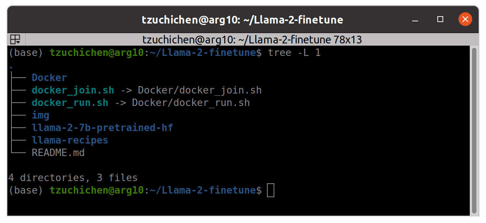
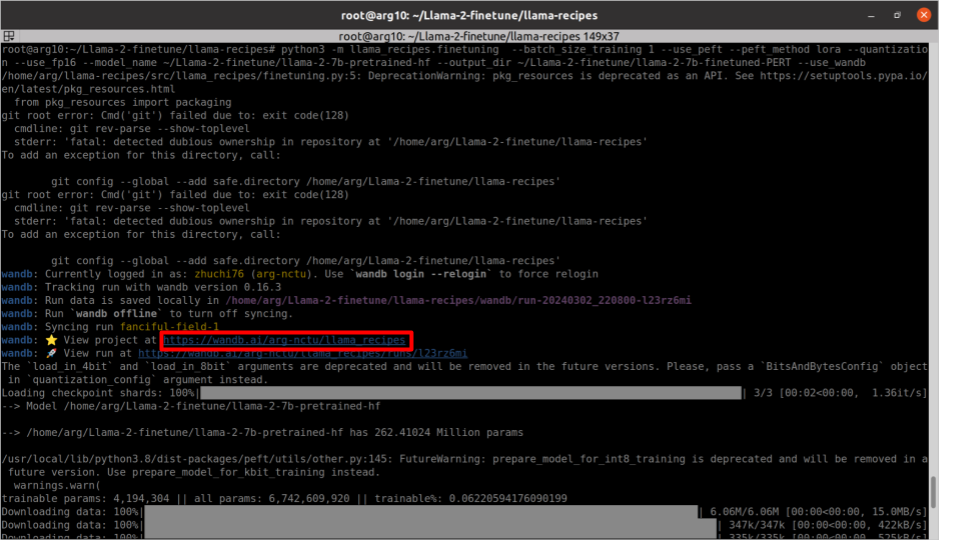
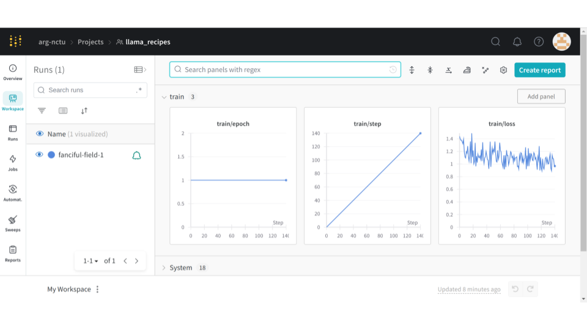

# First clone the repo
```bash
git clone --recurse-submodules git@github.com:ARG-NCTU/Llama-2-finetune.git
```

# Update the submodule (if needed)
```bash
git submodule update --init --recursive
```

# Enter the repo
```bash
cd Llama-2-finetune
```

# Download the pretrained model weights
Downlaod hugging face model pretrained weight from NAS.

Link: http://gofile.me/773h8/uYom43iVm

Enter the Downloads directory. 

Extract the zip file: unzip llama-2-7b-pretrained-hf.zip (10.7G)

Put it in the same directory as this README file.

The tree directory will be like:



# Pull and run the docker image
```bash
source docker_run.sh
```

# Log in and paste your API key when prompted
```bash
wandb login
```

# Finetune the model
```bash
cd ~/Llama-2-finetune/llama-recipes
```

```bash
python3 -m llama_recipes.finetuning  --batch_size_training 1 --use_peft --peft_method lora --quantization --use_fp16 --model_name ~/Llama-2-finetune/llama-2-7b-pretrained-hf --output_dir ~/Llama-2-finetune/llama-2-7b-finetuned-PERT --use_wandb
```

# See the training curve
Ctrl + click the url below


You will see the training curve in your browser


